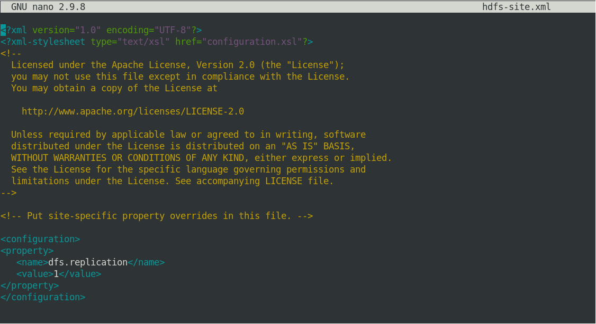

# Instalação e Configuração de um container Docker Apache Hadoop 


### Resumo


Esta página foi elaborada com informações básicas sobre como você pode preparar um ambiente de testes [Apache Hadoop](https://hadoop.apache.org/) usando um "*container*" [Docker](https://www.docker.com/) em sua máquina local.

Construir um ambiente de desenvolvimento e testes em um "**container**" Docker local não será uma tarefa fácil, mas nos permitirá, estudar, aprender, depurar erros e no meu caso, executar aplicações de análise de dados propostas nas aulas do curso de [Formação Cientista de Dados da Data Science Academy](https://www.datascienceacademy.com.br) o qual estou concluíndo.

No curso de Formação Cientista de Dados aprendemos a instalar e configurar de forma manual e a partir do zero em uma VM VirtualBox com Linux CentOS o Apache Hadoop e alguns dos produtos do seu Ecossistema.


``` Objetivo deste documento é ajudar você instalar e configurar de forma manual um container Docker Apache Hadoop em modo Pseudo-Distribuído (Pseudo-Distributed). ``` 


No final desta jornada teremos um ambiente de testes Apache Hadoop para estudos onde será produtivo experimentar o principal Framework para soluções de Big Data do mercado, tanto para armazenamento quando processamento de dados distribuído. 


### Aviso


Esta é uma sugestão de uma configuração inicial para uso em máquinas de testes. Não implemente em ambiente de produção.


### Pré-requisitos:   

    - Máquina com arquitetura 64Bits e sistema operacional Linux instalado.
    - Você precisa ter o Docker instalado em sua máquina local.
    - Noções básicas do funcionamento do Docker.

<!-- #region -->
### Lembrando que:

Quando estiver trabalhando no container, não use o comando "exit" para sair do console, se fizer seu container morre e você perderá todos os pacotes instalados até este ponto. 

Use o seguinte atalho do teclado: 


### mantenha o botão Crtl pressionado +p + q ### 

Assim, você sairá do container e ele continuará em execução.

```python 
$ docker attach <ID do Container> (voltar ao container)

```


Perceba que na ilustração acima, os ambientes máquina local e container Docker estão isolados apesar de compartilharem dos recursos de hardware da máquina local.

<!-- #region -->
# Iniciar a instalação

- Baixar uma [imagem Docker da distribuição Linux CentOS](https://hub.docker.com/_/centos)


```python
$ docker pull centos
```


<!-- #endregion -->
<!-- #endregion -->

<!-- #region -->
- Caso você tenha uma imagem local, use a instrução:

```python
$ docker pull localhost:5000/centos
```

<!-- #endregion -->


### Executar o Containers Docker CentOS


- Para subir um container em modo interativo, use instrução:

<!-- #region -->
```python
$ docker container run -ti localhost:5000/centos 
```

<!-- #endregion -->


- Caso sua imagem esteja local, use a instrução:

<!-- #region -->
```python
$ docker container run -ti centos 
```
<!-- #endregion -->

### Preparar o ambiente CentOS 


Agora vamos instalar alguns utilitários, pacotes adicionais e configurar o serviço SSH.

<!-- #region -->
```bash
$ yum update -y
$ yum install kernel -y
$ yum install kernel-devel -y
$ yum install kernel-headers -y
$ yum install initscripts -y
$ yum install gcc -y
$ yum install make -y
$ yum install perl -y
$ yum install ncurses -y
$ yum install bzip2 -y
$ yum install unzip -y
$ yum install rsync -y
$ yum install wget -y
$ yum install net-tools -y
$ yum install nano -y
$ yum install iproute -y
$ yum install passwd -y
$ yum install sudo -y
```
<!-- #endregion -->

### Instalar e configurar o SSH

<!-- #region -->
```bash
$ yum install openssh-server -y
$ yum install openssh-clients -y
```
<!-- #endregion -->

Editar o arquivo **/etc/ssh/sshd_config** e ajustar os seguintes parâmetros:
``` 
Port 22
ListemAdress 0.0.0.0
PermitRootLogin No
AllowUsers santana, hadoop 
```
(**Lembrando que:** no parâmetro AllowUsers estou usando o meu usuário, mas na sua máquina você ajusta o seu.)


Para editar os arquivos de configuração no console do Linux eu uso o comando: ```nano``` que é mais amigável que o ```vim```.

<!-- #region -->
```bash
$ sudo nano /etc/ssh/sshd_config
```
<!-- #endregion -->


Continuação da edição do arquivo de configuração di SSHD_CONFIG


Para gravar as alterações use o atalho do teclado: **(Ctrl + x + Y)**


### Criar os usuários de trabalho e administração

<!-- #region -->
```bash
$ adduser santana (cria usuário de trabalho)
$ adduser hadoop  (cria usuário de administração)
$ passwd santana
$ passwd hadoop
```
<!-- #endregion -->

Editar o arquivo ***/etc/sudoers*** e configure as permissões de acesso dos usuários, no meu caso, 
ajustei as permissões do usuário hadoop idênticas ao do usuário root no arquivo.

<!-- #region -->
```bash
$ sudo nano /etc/sudoers
```
<!-- #endregion -->


### Gerar chaves SSH no Linux


Para gerar uma chave SSH em seu servidor Linux, execute o comando ``` ssh-keygen ```. 

<!-- #region -->
```bash
$ ssh-keygen -A 
```
<!-- #endregion -->


### Configurar acesso SSH sem senha para o usuário hadoop


Antes, verifique se você pode acessar via ssh localhost sem uma senha longa:

<!-- #region -->
```python 
$ ssh localhost
``` 
<!-- #endregion -->


Se não foi possível logar via ssh localhost sem uma senha, então, execute a sequência de comandos abaixo:

<!-- #region -->
```python
  $ su hadoop
  $ ssh-keygen -t rsa -P '' -f ~/.ssh/id_rsa
  $ cat ~/.ssh/id_rsa.pub >> ~/.ssh/authorized_keys
  $ chmod 0600 ~/.ssh/authorized_keys
  $ sudo rm /run/nologin
```
<!-- #endregion -->

Verifique o acesso com o usuário root.

<!-- #region -->
```python
$ su root
$ ssh localhost
```
<!-- #endregion -->


***Correto! o usuário root não tem permissão para acesso remoto no serviço.***


Verifique o acesso com o usuário hadoop.

<!-- #region -->
```python
$ su hadoop
$ ssh localhost
```
<!-- #endregion -->


**Funcionou!** o usuário hadoop tem acesso sem senha no ssh, agora podemos continuar a instalação do Apache Hadoop


A partir deste ponto, você pode acessar o container via comandos ```docker attach``` ou ```ssh ```.


Para descobrir o IP do container use a instrução ```docker inspect <ID do Container>```.


### Backup


Agora que finalizamos a primeira etapa da preparação do ambiente, vamos gerar uma imagem customizada do container CentOS e enviá-lo para o repositório local. 


Lembre-se de que para sair do container e deixá-lo ainda em execução é necessário pressionar **Crtl + p + q**. 

<!-- #region -->
```python 
$ docker container ls
```
<!-- #endregion -->


Vamos listar os containers em execução para descobrir qual é o ID do CONTAINER que estamos customizando. 

<!-- #region -->
```python 
$ docker commit -m "Apache Hadoop" <ID do Container>
```
<!-- #endregion -->


Imagem gerada com sucesso! agora vamos enviar a imagem para o repositório.

<!-- #region -->
```python 
$ docker image ls
```
<!-- #endregion -->


A imagem customizada foi gerada, agora renomearemos a TAG e o repositório.

<!-- #region -->
```python 
$ docker tag 6361bba42a00 localhost:5000/centos:8.0
```
<!-- #endregion -->


Feito! a imagem foi renomeada, agora vamos enviá-la para o repositório Docker Local.

<!-- #region -->
```python 
$ docker push localhost:5000/centos:8.0
```
<!-- #endregion -->


Pronto! imagem arquivada com sucesso.


### Vamos criar [Volumes Docker](https://docs.docker.com/storage/volumes/) para compartilharmos arquivos com a máquina local.


Ao compartilhar uma pasta com a máquina local nos permitirá maior agilidade no download e cópia dos pacotes de softwares da máquina local para o container onde estamos instalando o Apache Hadoop. 


### Criar volumes

<!-- #region -->
```python 
$ docker volume create datasets
$ docker volume create hadoop_home
``` 
<!-- #endregion -->


Os volumes foram criados, agora vamos subir nova instância do container customizada para acesso as pastas.


Para o container atual

<!-- #region -->
```python
$ docker ps
``` 
<!-- #endregion -->


<!-- #region -->
```python
$ docker stop 6aa313b91f6d
``` 
<!-- #endregion -->


O container foi encerrado. Agora, vamos subir o novo container com os acessos compartilhados.

<!-- #region -->
```python
$ docker container run -ti \
    --mount type=volume,source=datasets,destination=/opt \
    --mount type=volume,source=hadoop_home,destination=/home/hadoop \
    localhost:5000/centos:8.0
```
<!-- #endregion -->


Pronto, o novo container foi criado. Vamos testar os compartilhamentos de arquivos, vou copiar arquivos para os diretótios **datasets** e **hadoop_home** na máquina local. Que serão listados respectivamente em **/opt** e **/home/hadoop** do container.


Para descobrir onde os volumes foram criados na máquina local digite no console da máquina local:

<!-- #region -->
```python
$ docker inspect datasets
```
<!-- #endregion -->


``` Acesse cd /var/lib/docker/volumes/datasets/_data ``` vou padronizar neste diretório a cópia de todos os pacotes do Apache Hadoop que baixaremos.


Para testarmos o mapeamento copiei o JDK que instalaremos.

<!-- #region -->
```python
$ docker inspect hadoop_home
```
<!-- #endregion -->


``` Acesse cd /var/lib/docker/volumes/hadoop_home/_data ``` Este será um diretório persistente do usuário hadoop.


## Agora vamos a Instalção do Apache Hadoop


### O ambiente Hadoop será instalado e configurado com o login hadoop. 


Para logar no container com usuário hadoop, digite no console do container ``` su hadoop ```


### Iniciar a instalação do Java 1.8


Precisamos instalar o Java 8 porque alguns pacotes do Apache Hadoop, não são compatíveis com versões superiores do JDK. 


Faça o [download do pacote JDK](https://www.oracle.com/br/java/technologies/javase/javase-jdk8-downloads.html) no site da Oracle para sua máquina local e depois copie o pacote para: 


``` 
 /var/lib/docker/volumes/datasets/_data
```


Eu vou usar o pacote TAR para a customização e padronização do ambiente.


O Java 1.8 foi baixado e copiado para o diretório``` datasets ``` na máquina local que é o diretório ``` /opt ``` no container Hadoop, esta customização nos permitirá agilidade na troca de arquivos entre os ambientes de teste e desenvolvimento.


2. Para instalar o java você precisa descompactar o arquivo jdk-8u281-linux-x64.tar.gz em /opt e configurar as variáveis de ambiente.


**Para instalar o JDK execute a sequencia de instruções abaixo no console do container:**

<!-- #region -->
```python
$ su hadoop
$ cd /opt
$ sudo tar xvf jdk-8u281-linux-x64.tar.gz
$ sudo chown hadoop:hadoop -R jdk1.8.0_281/
$ sudo mv jdk1.8.0_281/ jdk/
$ sudo chmod 775 -R jdk

```
<!-- #endregion -->


Feito, o java foi copiado para /opt e ajustamos a nomenclatura as permissões. Agora vamos configuras as variáveis de ambiente e testar.


**Vamos editar o arquivo .bashrc e incluir as variáveis de memória do JAVA (JDK)**


Execute a sequencia de instruções abaixo:

<!-- #region -->
```python
$ cd 
$ nano .bashrc (nano é um editor de texto leve e amigável para o Shell do Linux)

# JAVA
export JAVA_HOME=/opt/jdk
export PATH=$PATH:$JAVA_HOME/bin

$ source .bashrc
```
<!-- #endregion -->


Vamos testar e verificar se o Java (JDK) foi instalado corretamente.


Feito! o java 1.8 foi instalado com sucesso. 


# Instalação do Hadoop


Faça o [download do pacote Hadoop](http://hadoop.apache.org/) no site da Apache Software Fundation para sua máquina local.


Quando o download terminar, copie o pacote para: ```/var/lib/docker/volumes/datasets/_data ``` em sua máquina local e inicie a instalação do Hadoop. 

**Resumindo:** 

A instalação do Hadoop consiste em descompactar o arquivo baixado no diretório **/opt**, ajustar as permissões e nomenclaturas e inserir as variáveis de ambiente no arquivo **.bashrc** do usuário **hadoop**. 

<!-- #region -->
```bash
$ sudo cp hadoop-3.2.2.tar.gz /var/lib/docker/volumes/datasets/_data
$ docker attach bb2b1c7c82fb
$ cd /opt
$ id (caso não esteja logado como hadoop, digite su haddop)
$ sudo tar xvf hadoop-3.2.2.tar.gz
$ sudo mv hadoop-3.2.2 hadoop
$ sudo chown hadoop:hadoop hadoop -R
$ sudo chmod 775 hadoop -R
$ mkdir /home/hadoop/Downloads
$ sudo mv hadoop-3.2.2.tar.gz /home/hadoop/Downloads
$ clear
$ ls -lia
``` 
<!-- #endregion -->


Agora vamos ajustar as variáveis de ambiente no arquivo .bashrc

<!-- #region -->
```bash
$ cd
$ nano .bashrc

# Apache Hadoop
export HADOOP_HOME=/opt/hadoop
export HADOOP_INSTALL=$HADOOP_HOME
export HADOOP_COMMON_HOME=$HADOOP_HOME
export HADOOP_MAPRED_HOME=$HADOOP_HOME
export HADOOP_HDFS_HOME=$HADOOP_HOME
export YARN_HOME=$HADOOP_HOME
export PATH=$PATH:$HADOOP_HOME/bin:$HADOOP_HOME/sbin

$ source .bashrc

``` 
<!-- #endregion -->


As variáveis de ambiente foram configuradas, agora vamos testar.

<!-- #region -->
```bash
$  hadoop version
``` 
<!-- #endregion -->


Feito! toda a configuração foi realizada com sucesso.


# Configuração do Hadoop


Vamos configurar o Hadoop no Modo Pseudo-Distribuído (Pseudo-Distributed). 


Edite os arquivos de configuração que estão no ``` /opt/hadoop/etc/hadoop ``` e insira respectivamente os parâmetros abaixo:

1. core-site.xml

```xml
<property>
    <name>fs.defaultFS</name>
    <value>hdfs://localhost:9000</value>
</property>
```


2. hdfs-site.xml

```xml
<property>
   <name>dfs.replication</name>
   <value>1</value>
</property>
```





**O processo de instalação e configuração do Apache Hadoop foi concluído.**


# Vamos inicializar o HDFS


Execute as seguintes instruções:


1. Formate o sistema de arquivos:

<!-- #region -->
``` bash
$ hdfs namenode -format
```
<!-- #endregion -->


O sistema de arquivos foi formatado com sucesso!


2. Estamos prontos para inicializar o HDFS, para iniciar digite:

<!-- #region -->
``` bash
$ start-dfs.sh
```
<!-- #endregion -->


Ocorreu um erro! este problema ocorre porque precisamos inicializar o serviço SSH. 


3. Para inicializar o SSH no container digite:

<!-- #region -->
``` bash
$ sudo /usr/sbin/sshd
```
<!-- #endregion -->

4. Agora, inicie o HDFS novamente.

<!-- #region -->
``` bash
$ start-dfs.sh
```
<!-- #endregion -->


**Pronto, o serviço HDFS foi inicializado!**

# Experimento

<!-- #region -->
``` bash
$ jps (Este é uma instrução que permite visualizar todos os serviços do Hadoop que estão rodando)
```
<!-- #endregion -->


Os serviços estão rodando.


Para você acessar o Namenode via browser e ver detalhes do ambiente, abra o seu browser favorito na sua máquina local e digite:

<!-- #region -->
(**Lembrando que**: O IP do container será diferente na sua máquina, informe o seu IP e a porta)

``` bash
$ http://172.17.0.3:9870/ 
```
<!-- #endregion -->


Recomendo que você navegue um pouco e explore as opções.


**Alguns comandos adicionais:**

<!-- #region -->
``` bash
$ hdfs dfs -ls /
$ hdfs dfs -mkdir /user
$ hdfs dfs -mkdir /user/hadoop
$ hdfs dfs -put /opt/hadoop/etc/hadoop/*xml /user/hadoop
$ hdfs dfs -ls /user/hadoop
$ stop-dfs.sh
```
<!-- #endregion -->


Pronto! o nosso ambiente está funcionando perfeitamente.


# Configurando e inicializando o YARN


O YARN é uma gerenciamento de recursos para Apache Hadoop. 


O YARN roda sobre o HDFS e permite diferentes mecanismos de processamento de dados. O Apache YARN é considerado o sistema operacional de dados do Hadoop.


Para habilitar o YARN edite os arquivos de configuração que estão no /opt/hadoop/etc/hadoop e insira respectivamente os parâmetros abaixo:


1. mapred-site.xml:
```xml
<property>
  <name>mapreduce.framework.name</name>
  <value>yarn</value>
</property>
<property>
  <name>mapreduce.application.classpath</name>
  <value>$HADOOP_MAPRED_HOME/share/hadoop/mapreduce/*:$HADOOP_MAPRED_HOME/share/hadoop/mapreduce/lib/*</value>
</property>
```


Grave a configuração


1. yarn-site.xml:
```xml
<property>
    <name>yarn.nodemanager.aux-services</name>
    <value>mapreduce_shuffle</value>
</property>
<property>
    <name>yarn.nodemanager.env-whitelist</name>
    <value>JAVA_HOME,HADOOP_COMMON_HOME,HADOOP_HDFS_HOME,HADOOP_CONF_DIR,CLASSPATH_PREPEND_DISTCACHE,HADOOP_YARN_HOME,HADOOP_MAPRED_HOME</value>
</property>
```


Grave a configuração


# Vamos inicializar o YARN


Execute as seguintes instruções:

<!-- #region -->
``` bash
$ start-yarn.sh
```
<!-- #endregion -->


Os serviços foram inicializados.

<!-- #region -->
``` bash
$ jps
```
<!-- #endregion -->


Agora temos os serviços do HDFS e YARN rodando.


Para você acessar o ResourceManager via browser e ver detalhes do ambiente, abra o seu browser favorito na sua máquina local e digite:

<!-- #region -->
(**Lembrando que**: O IP do container será diferente na sua máquina, informe o seu IP e a porta)

``` bash
$ http://172.17.0.3:8088/
```
<!-- #endregion -->


<!-- #region -->
Recomendo que você navegue um pouco e explore as opções. E, antes de sair, encerre os serviços:

``` bash

$ stop-yarn.sh (YARN)
$ stop-dfs.sh (HDFS)
$ docker container stop <ID do Container> (Container Docker que está rodando o Hadoop)

```
    
<!-- #endregion -->

**Pronto!** 

Chegou o final a nossa jornada para a instalação e configuração do container Docker para o nosso ambiente de testes Apache Hadoop para estudos.


Espero ter contribuido com o seu desenvolvimento de alguma forma.


[Carlos Eugênio](https://carlosemsantana.github.io/)


### Referências 


1. [Curso de Formação Cientista de Dados da Data Science Academy](https://www.datascienceacademy.com.br)
2. [Docker Hub](https://hub.docker.com/_/centos)
3. Livro: Descomplicando o Docker 2a edição<br>
   Jeferson Fernando Noronha Vitalino<br>
   Marcus André Nunes Castro<br>
4. [The Hadoop Ecosystem Table](http://hadoopecosystemtable.github.io/)
5. [Gerando e usando chaves SSH para autenticação de host remoto](https://cloud.ibm.com/docs/ssh-keys?topic=ssh-keys-generating-and-using-ssh-keys-for-remote-host-authentication)
6. [Configurar acesso Cluster Pseudo-Distribuído](https://hadoop.apache.org/docs/r3.2.2/hadoop-project-dist/hadoop-common/SingleCluster.html#Pseudo-Distributed_Operation)
7. [Volumes Dockers](https://docs.docker.com/storage/volumes/)
8. [Apache Hadoop](https://hadoop.apache.org/docs/current/hadoop-project-dist/hadoop-common/SingleCluster.html)
9. [Apache Hadoop YARN](https://hadoop.apache.org/docs/current/hadoop-yarn/hadoop-yarn-site/YARN.html)
